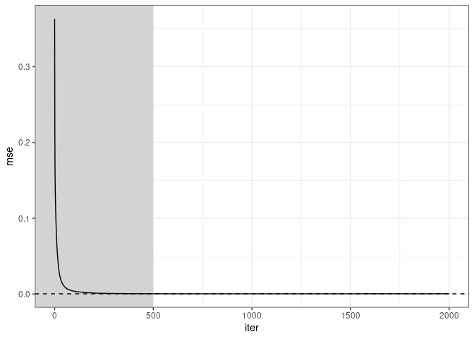

<!-- README.md is generated from README.Rmd. Please edit that file -->

# gammaFrailty

<!-- badges: start -->

[](https://lifecycle.r-lib.org/articles/stages.html#experimental)
[](https://CRAN.R-project.org/package=gammaFrailty)
<!-- badges: end -->

The gammaFrailty package allows the estimation of serially correlated
Gamma-frailty models for count data as described in [Henderson &
Shimakura
(2003)](https://academic.oup.com/biomet/article/90/2/355/241234).

## Installation

You can install the development version of gammaFrailty via:

``` r
install.packages('gammaFrailty.tar.gz', repos = NULL)
```

## Example

Simple illustrative setting similar to [Henderson & Shimakura
(2003)](https://academic.oup.com/biomet/article/90/2/355/241234)

``` r
library(gammaFrailty)
library(dplyr)
#> 
#> Caricamento pacchetto: 'dplyr'
#> I seguenti oggetti sono mascherati da 'package:stats':
#> 
#>     filter, lag
#> I seguenti oggetti sono mascherati da 'package:base':
#> 
#>     intersect, setdiff, setequal, union
library(purrr)
library(ggplot2)

seed <- 123
set.seed(seed)

# Setup data generating process
## Set dimensions
p <- 12; q <- 8; m <- 2; n <- 2000

## Set parameters
xi <- 2/q; rho <- .6;
int <- rep(log(4), p)
b <- rep(0, m) 

## True parameter vector (and its reparameterisation)
theta <- c(xi, rho, b, int)
repar_theta <- partorepar(theta)
d <- length(theta)

## Generate binary covariates
X <- matrix(rbinom(m*n, 1, .5), n, m)

## Generate data
data <- generate_data(
    INTERCEPT = int,
    BETA = b,
    X = X,
    Q = q,
    RHO = rho,
    SEED = seed,
    STRUCT = 'COMPOUND'
)


# Estimation
## Initialisation vector
par_init <- repar_theta + runif(length(repar_theta), -1, 1)
```

Fit with pairwise likelihood estimator:

``` r
fit <- fit_gammaFrailty2(
    DATA_LIST = list('DATA' = data, 'X' = X),
    METHOD = 'ucminf',
    CPP_CONTROL = list(),
    PAIRS_RANGE = p,
    VERBOSEFLAG= 0,
    INIT = par_init,
    ITERATIONS_SUBSET = NULL,
    STRUCT = 'COMPOUND'
)
#> 1. Initialising at init vector.
#> 2. Optimising with ucminf...
#> 3. Done! (12.27 secs)

mean((repartopar(fit$theta)-theta)^2)
#> [1] 0.000307326
mean((repartopar(par_init)-theta)^2)
#> [1] 0.3631014
```

Fit with stochastic estimator:

``` r

cpp_ctrl <- list(
            MAXT = n,
            BURN = .25,
            STEPSIZE = 1,
            SCALEVEC = rep(1,d),
            PAR2 = 1,
            PAR3 = .501,
            NU = 1,
            STEPSIZEFLAG = 0,
            SAMPLING_WINDOW = 500,
            EACHCLOCK = 500,
            SEED = 123
        )

stFit <- fit_gammaFrailty2(
                DATA_LIST = list('DATA' = data, 'X' = X),
                METHOD = 'recycle_hyper',
                CPP_CONTROL = cpp_ctrl,
                PAIRS_RANGE = p,
                VERBOSEFLAG= 0,
                INIT = par_init,
                ITERATIONS_SUBSET = NULL,
                STRUCT = 'COMPOUND'
            )
#> 1. Initialising at init vector.
#> 2. Optimising with recycle_hyper...
#> 
#> 3. Done! (0.17 secs)
mean((repartopar(stFit$theta)-theta)^2)
#> [1] 0.0003661119
```

Plot stochastic mean square error trajectory against numerical one

``` r
res <- get_tidy_path(stFit, 'path_av_theta', FALSE)
res |> 
    mutate(mse = map_dbl(path_av_theta, ~mean((repartopar(.x)-theta)^2))) |> 
    ggplot(aes(x=iter, y=mse))+
    geom_rect(aes(xmin=-Inf,xmax=cpp_ctrl$BURN*n,ymin=-Inf,ymax=Inf),
              fill="lightgrey", color =NA)+
    geom_line()+
    geom_hline(yintercept = mean((repartopar(fit$theta)-theta)^2), linetype = 'dashed') +
    theme_bw()
```



``` r
sessionInfo()
#> R version 4.1.2 (2021-11-01)
#> Platform: x86_64-pc-linux-gnu (64-bit)
#> Running under: Ubuntu 22.04.4 LTS
#> 
#> Matrix products: default
#> BLAS:   /usr/lib/x86_64-linux-gnu/blas/libblas.so.3.10.0
#> LAPACK: /usr/lib/x86_64-linux-gnu/lapack/liblapack.so.3.10.0
#> 
#> locale:
#>  [1] LC_CTYPE=it_IT.UTF-8       LC_NUMERIC=C              
#>  [3] LC_TIME=it_IT.UTF-8        LC_COLLATE=it_IT.UTF-8    
#>  [5] LC_MONETARY=it_IT.UTF-8    LC_MESSAGES=it_IT.UTF-8   
#>  [7] LC_PAPER=it_IT.UTF-8       LC_NAME=C                 
#>  [9] LC_ADDRESS=C               LC_TELEPHONE=C            
#> [11] LC_MEASUREMENT=it_IT.UTF-8 LC_IDENTIFICATION=C       
#> 
#> attached base packages:
#> [1] stats     graphics  grDevices utils     datasets  methods   base     
#> 
#> other attached packages:
#> [1] ggplot2_3.5.1           purrr_1.0.2             dplyr_1.1.4            
#> [4] gammaFrailty_0.0.0.9000
#> 
#> loaded via a namespace (and not attached):
#>  [1] Rcpp_1.0.12         highr_0.10          pillar_1.9.0       
#>  [4] compiler_4.1.2      tools_4.1.2         digest_0.6.33      
#>  [7] evaluate_0.21       lifecycle_1.0.4     tibble_3.2.1       
#> [10] gtable_0.3.5        ucminf_1.2.0        pkgconfig_2.0.3    
#> [13] rlang_1.1.3         cli_3.6.2           rstudioapi_0.15.0  
#> [16] yaml_2.3.7          mvtnorm_1.2-3       xfun_0.40          
#> [19] fastmap_1.1.1       withr_3.0.0         knitr_1.43         
#> [22] generics_0.1.3      vctrs_0.6.5         grid_4.1.2         
#> [25] tidyselect_1.2.0    glue_1.7.0          R6_2.5.1           
#> [28] fansi_1.0.6         rmarkdown_2.24      farver_2.1.2       
#> [31] magrittr_2.0.3      scales_1.3.0        htmltools_0.5.6    
#> [34] colorspace_2.1-0    labeling_0.4.3      utf8_1.2.4         
#> [37] munsell_0.5.1       RcppEigen_0.3.4.0.0
```
