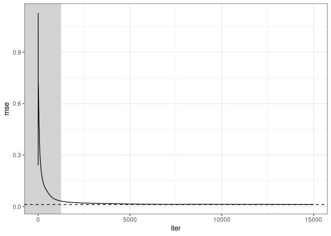

<!-- README.md is generated from README.Rmd. Please edit that file -->

# stIsing

<!-- badges: start -->

[](https://lifecycle.r-lib.org/articles/stages.html#experimental)
[](https://CRAN.R-project.org/package=stIsing)
<!-- badges: end -->

The stIsing package allows the estimation of binary graph models

## Installation

``` r
install.packages('stIsing.tar.gz', repos = NULL)
```

## Example

Set-up the structure of the data generating graph:

``` r
library(stIsing)
library(dplyr)
#> 
#> Caricamento pacchetto: 'dplyr'
#> I seguenti oggetti sono mascherati da 'package:stats':
#> 
#>     filter, lag
#> I seguenti oggetti sono mascherati da 'package:base':
#> 
#>     intersect, setdiff, setequal, union
library(ggplot2)
library(purrr)

p <- 10
d <- p + p*(p-1)/2

parNodes <- rep(c(-1,1), p/2)
parEdgesMat <- matrix(0,p, p)
counter <- 1
for (col in 1:(p-1)) {
    for (row in (col+1):p) {
        if(abs(col-row)==1 & (min(col,row)!=p/2)) parEdgesMat[row, col] <- .5
        if(abs(col-row)==p/2) parEdgesMat[row, col] <- -.5
    }
}
parEdgesMat
#>       [,1] [,2] [,3] [,4] [,5] [,6] [,7] [,8] [,9] [,10]
#>  [1,]  0.0  0.0  0.0  0.0  0.0  0.0  0.0  0.0  0.0     0
#>  [2,]  0.5  0.0  0.0  0.0  0.0  0.0  0.0  0.0  0.0     0
#>  [3,]  0.0  0.5  0.0  0.0  0.0  0.0  0.0  0.0  0.0     0
#>  [4,]  0.0  0.0  0.5  0.0  0.0  0.0  0.0  0.0  0.0     0
#>  [5,]  0.0  0.0  0.0  0.5  0.0  0.0  0.0  0.0  0.0     0
#>  [6,] -0.5  0.0  0.0  0.0  0.0  0.0  0.0  0.0  0.0     0
#>  [7,]  0.0 -0.5  0.0  0.0  0.0  0.5  0.0  0.0  0.0     0
#>  [8,]  0.0  0.0 -0.5  0.0  0.0  0.0  0.5  0.0  0.0     0
#>  [9,]  0.0  0.0  0.0 -0.5  0.0  0.0  0.0  0.5  0.0     0
#> [10,]  0.0  0.0  0.0  0.0 -0.5  0.0  0.0  0.0  0.5     0

true_theta <- parNodes
for (col in 1:(p-1)) {
    for (row in (col+1):p) {
        true_theta <- c(true_theta, parEdgesMat[row, col])
    }
}
true_theta
#>  [1] -1.0  1.0 -1.0  1.0 -1.0  1.0 -1.0  1.0 -1.0  1.0  0.5  0.0  0.0  0.0 -0.5
#> [16]  0.0  0.0  0.0  0.0  0.5  0.0  0.0  0.0 -0.5  0.0  0.0  0.0  0.5  0.0  0.0
#> [31]  0.0 -0.5  0.0  0.0  0.5  0.0  0.0  0.0 -0.5  0.0  0.0  0.0  0.0  0.0 -0.5
#> [46]  0.5  0.0  0.0  0.0  0.5  0.0  0.0  0.5  0.0  0.5
length(true_theta)
#> [1] 55
```

Generate data from the IsingSampler package

``` r
n <- 5000
graph_mat <- ising_from_theta_to_emat(true_theta, p)
graph_mat <- graph_mat + t(graph_mat)
thr_vec <- true_theta[1:p]

seed <- 123
set.seed(seed)
data <- IsingSampler::IsingSampler(n, graph_mat, thr_vec, 1, method = "direct")
```

Fit the model numerically:

``` r
Q <- rep(TRUE, length(true_theta))                                # No constraints
theta_init <- rep(0, length(true_theta))                          # Initialisation

fit <- fit_isingGraph3(
    DATA_LIST = list(DATA = as.matrix(data), CONSTRAINTS = Q),
    METHOD = 'ucminf',
    CPP_CONTROL = list(),
    INIT = theta_init,
    VERBOSEFLAG = 0
)
#> 1. Initialising at init vector.
#> 2. Optimising with ucminf...
#> 3. Done! (5.97 secs)
mean((fit$theta-true_theta)^2)
#> [1] 0.0119769
mean((theta_init-true_theta)^2)
#> [1] 0.2409091
```

Fit the model stochastically:

``` r
tictoc::tic()

# temporary stochastic estimator control list
cpp_ctrl <- list(
      MAXT = n,
      BURN = .25,
      STEPSIZE = 1,
      SCALEVEC = rep(1,d),
      PAR1 = 1,
      PAR2 = 1,
      PAR3 = .501,
      NU = 1,
      STEPSIZEFLAG = 0,
      SAMPLING_WINDOW = 500,
      EACHCLOCK = 500
    )

# stepsize tuning
tn <- stepsize_tuning4(
        DATA_LIST = list(DATA = as.matrix(data), CONSTRAINTS = Q, HOLDOUT = as.matrix(data)),
        METHOD = 'recycle_hyper',
        CPP_CONTROL = cpp_ctrl,
        STEPSIZE_INIT = 10,
        LENGTH = 0.5,
        INIT = rep(0, d),
        VERBOSEFLAG = 0
    )

# update stochastic estimator control list
cpp_ctrl$STEPSIZE <- cpp_ctrl$PAR2 <- tn$best_step
cpp_ctrl$MAXT <- 3*n

# fit with hypergeometric recycled sampling  
stFit <- fit_isingGraph3(
        DATA_LIST = list(DATA = as.matrix(data), CONSTRAINTS = Q),
        METHOD = 'recycle_hyper',
        CPP_CONTROL = cpp_ctrl,
        INIT = theta_init,
        VERBOSEFLAG = 0
      )
#> 1. Initialising at init vector.
#> 2. Optimising with recycle_hyper...
#> 3. Storing results
#> 4. Done! (0.13 secs)
tictoc::toc()
#> 0.472 sec elapsed

mean((stFit$theta-true_theta)^2)
#> [1] 0.01282374
```

Plot stochastic estimator mean square error trajectory against numerical
one

``` r
res <-  get_tidy_path3(stFit, 'path_av_theta')
res |> 
    mutate(mse = map_dbl(path_av_theta, ~mean((.x-true_theta)^2))) |> 
    ggplot(aes(x=iter, y=mse))+
    geom_rect(aes(xmin=-Inf,xmax=cpp_ctrl$BURN*n,ymin=-Inf,ymax=Inf),
              fill="lightgrey", color =NA)+
    geom_line()+
    geom_hline(yintercept = mean((fit$theta-true_theta)^2), linetype = 'dashed') +
    theme_bw()
```


